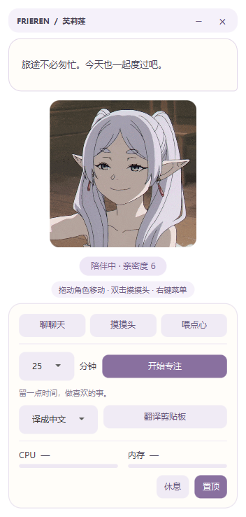

# 芙莉莲桌面旅伴 · Frieren Desktop
>个人练习项目


一个基于 **JavaFX** 开发的芙莉莲桌面精灵：陪你聊聊天、收下点心，也陪你完成一段专注时光。

这是我的第一个 JavaFX 项目，用于练习 Java 多线程、REST API 与 JMX 系统监控。

## 界面预览

奶白与浅紫色面板，gif动图网上随便找的。展开工具面板可以使用专注计时、翻译和系统监控；收起后保留角色、对话气泡与状态。

| 展开模式 | 收起模式 |
| --- | --- |
|  |  |

截图来自实际 JavaFX 界面测试；系统监控尚未采样时显示为 `—`。

## 能做什么

| 功能 | 说明 |
| --- | --- |
| 桌面陪伴 | 角色动图、自由拖动、右键菜单、窗口置顶开关 |
| 分时段聊天 | 清晨、白天和深夜使用不同台词 |
| 摸摸头 | 点击按钮或双击角色，增加 1 点亲密度并播放轻微缩放反馈 |
| 点心投喂 | 成功投喂增加 5 点亲密度，冷却时间为 30 秒 |
| 专注计时 | 可选 15、25、45 分钟，支持取消；完成后提醒休息并增加 10 点亲密度 |
| 休息模式 | 暂停普通陪伴提醒；已有专注计时继续运行，完成提醒仍会显示 |
| 系统监控 | 每 2 秒采样 CPU 与物理内存占用，以数值和进度条呈现 |
| 高负载提醒 | CPU 占用超过 85% 时提醒；休息和专注期间不提醒，两次提醒至少间隔 2 分钟 |
| 陪伴提醒 | 5 分钟未与本应用互动时提醒喝水；休息和专注期间暂停 |
| 剪贴板翻译 | 手动将剪贴板文字译成中文或英文，支持查看并复制完整结果 |

亲密度上限为 **100**。

## 快速开始

### 环境要求

- **JDK 25**：`JAVA_HOME` 指向 JDK，并将其 `bin` 目录加入 `PATH`。
- **图形桌面环境**：应用使用 JavaFX 窗口。
- **网络连接**：首次运行需要下载 Maven 和依赖；翻译功能需要联网。

项目自带 Maven Wrapper，无需单独安装 Maven。JavaFX 依赖由 Maven 下载。

## 怎么互动

- **移动**：按住角色或标题栏拖动，松开后窗口会调整到所在屏幕的可见区域。
- **聊天**：点击“聊聊天”，听一句旅途中的话。
- **摸头**：点击“摸摸头”，或用鼠标左键双击角色。
- **投喂**：点击“喂点心”；冷却期间会提示稍后再来。
- **专注**：选择分钟数，点击“开始专注”；再次点击可取消。
- **休息 / 唤醒**：点击“休息”，角色变淡；点击“唤醒”恢复陪伴。
- **收起 / 展开**：点击标题栏的 `−` / `+`。
- **完整留言**：点击对话气泡，打开可选中、复制文字的详情窗口。
- **退出**：点击标题栏的 `×`，或使用角色右键菜单。

## 翻译

翻译使用 **百度翻译 API**，需要你自己的 App ID 和密钥。未配置时，其他功能仍可正常使用。

在启动应用的同一个终端中设置环境变量：

**PowerShell：**

```powershell
$env:BAIDU_APP_ID = "你的 App ID"
$env:BAIDU_SECRET_KEY = "你的密钥"
.\mvnw.cmd javafx:run
```

**Bash：**

```bash
export BAIDU_APP_ID="你的 App ID"
export BAIDU_SECRET_KEY="你的密钥"
sh mvnw javafx:run
```

复制文字后，在工具面板选择“译成中文”或“译成英文”，再点击“翻译剪贴板”。不要把个人密钥写进源码或提交到 Git。

- 仅在你点击翻译时读取剪贴板，并把该段文字发送到百度翻译服务。
- 原文语言自动识别，目标语言由工具面板选择。
- 单次输入最多 **6000 UTF-8 字节**，并非 6000 个字符。
- 请求超时为 **15 秒**；等待过程中不会阻塞界面。
- 请求期间禁用翻译按钮，避免重复发送。
- 翻译成功后点击气泡可查看、选择和复制完整结果。

在线翻译仍需使用有效个人凭证验证，当前自动测试覆盖响应解析与异常处理。

## 项目结构

```text
src/
├─ main/
│  ├─ java/xyz/p050501/frierendesktop/
│  │  ├─ Launcher.java              # 普通 Java 启动入口
│  │  ├─ FrierenApp.java            # JavaFX 生命周期
│  │  ├─ model/
│  │  │  └─ CompanionState.java     # 亲密度、冷却、休息与专注状态
│  │  ├─ service/
│  │  │  ├─ QuoteService.java       # 分时段台词
│  │  │  ├─ SystemMonitor.java      # JMX 系统资源采样
│  │  │  └─ TranslationService.java # HTTP 请求、签名及响应解析
│  │  └─ ui/
│  │     ├─ PetView.java            # 界面布局
│  │     ├─ PetController.java      # 操作绑定、调度和窗口行为
│  │     └─ BubblePresenter.java    # 气泡显示与统一计时
│  └─ resources/
│     ├─ frieren.gif                # 角色动画
│     └─ xyz/p050501/frierendesktop/pet.css
└─ test/java/xyz/p050501/frierendesktop/
   ├─ model/                       # 状态规则测试
   ├─ service/                     # 台词与翻译解析测试
   └─ ui/                          # JavaFX 界面冒烟测试
```

## 测试与构建

常规测试不需要启动图形界面：

```powershell
.\mvnw.cmd test
```

界面测试需要可用的图形桌面，会短暂创建窗口并生成预览图：

```powershell
.\mvnw.cmd "-DuiTests=true" test
```

截图保存在 `target/ui-expanded.png` 和 `target/ui-compact.png`。Bash 下将命令中的 `.\mvnw.cmd` 替换为 `sh mvnw`。

构建 JAR：

```powershell
.\mvnw.cmd clean package
```

当前产物是普通 JAR，尚未包含完整运行时和全部依赖；日常启动请使用 `javafx:run`。项目尚未提供一键安装包。

现有 **7 项测试**覆盖投喂冷却、亲密度上限、休息与专注相互作用、倒计时与取消、台词时间边界、翻译异常响应，以及主要按钮和面板布局。

## 当前限制

- 亲密度、窗口位置、置顶和休息选项尚未持久化，重启后重置。
- 陪伴提醒依据本应用内的操作时间，尚未检测整个系统的键鼠活动。
- 系统监控依赖 JMX；无法获取的指标显示为 `—`。
- 目前只有一份角色动画；休息与互动反馈使用透明度和缩放变化。
- 桌面窗口尚未提供系统托盘入口或穿透鼠标功能。


>为了学习java、练习git做的小项目，欢迎批评。
